# Word Puzzle Game
Word Puzzle Game is a simple and fun word game created using HTML, CSS, and JavaScript. Players are presented with a grid of letters, and their task is to find as many words as they can by connecting adjacent letters. The words are randomly selected with interactive interface for refreshing game incase you don't know the word, timer section to add some challange and excitement to the game, a section for giving you a hint and definition of word. It is responsive and playable on desktop, laptop and all other snmaller devices.The Word Puzzle Game is a single-player game where the player is presented with a scrambled word and a hint. The player must unscramble the word within a time limit. The game consists of multiple rounds, and the player's score is based on the number of correct answers. [link to the game](https://htadicha.github.io/Brain-Teaser-word-Quiz/)

## UX/UI
The projects was created with mobile first design, during the planning the main focus was to optimise it for smaller screen and before adopting it for larger devices. The components of the game website is visible and tidy with a well maintained semantic struicture  and or textual elements.
The well written game area provides clear purpose of the page, a section for checkng answers for the word you guessed, a button for refreshing the game if the words are not known. A timer section to tease your brain

The following elements are considered when building the gamne:
1. __Intuitive Gameplay:__ Seamlessly navigate through the game with user-friendly interfaces, ensuring easy access to all features and instructions.

2. __Responsive Design:__ Enjoy a consistent and engaging gaming experience on any device, as our game adapts to various screen sizes and resolutions.

3. __Clear and Concise Instructions:__ Access game rules effortlessly through concise yet comprehensive descriptions, minimizing confusion and maximizing clarity for players.

3. __Interactive Gameplay:__ Engage with dynamic elements that enhance user interaction and enjoyment, creating an immersive gaming experience.

4. __Personalized Challenges:__ Coming soon! Receive tailored challenges and difficulty levels based on your progress and preferences, optimizing your gaming experience.

5. __Efficient Word Search:__ Coming soon! Quickly find words with powerful search capabilities, allowing you to locate words efficiently and enhancing your gameplay.

## Features
 ### Game Title

The game title is crucial as it serves as the first point of contact for players, conveying the essence and attracting attention, setting expectations for the gameplay experience.

 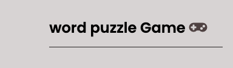
 ### Game Area

The game area is essential as it provides the interactive space where players engage with the game mechanics, facilitating immersion and gameplay interaction. Through the refresh button and the check your answer button, a user will be able to interact with the game. A timer section to provide some level excitment and pressure for fun.

 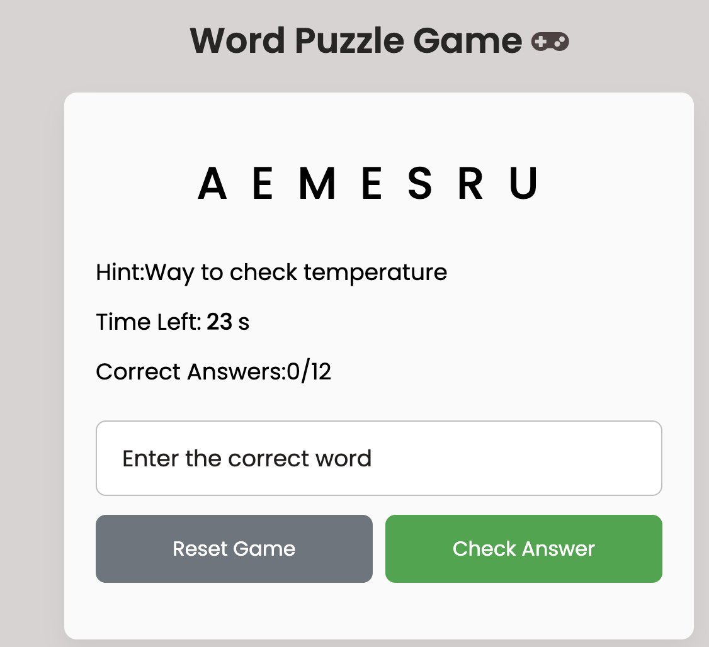
 ### Reset  and Check answer button 

The game refresh and submit buttons are vital as they enable players to control the flow of gameplay, allowing for the submission of answers and refreshing the game grid for continuous engagement and progress. The refresh button will bring another random word if the user is not familier with the current word.

 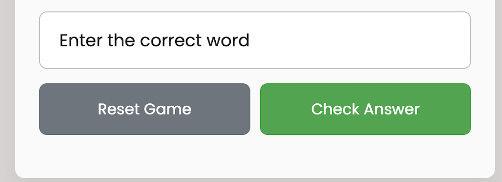

 ## Scrambled Words:
 Each word is scrambled, and the player must unscramble it to form the correct word.
 
 ## Hints:
A hint is provided for each word to help the player guess the correct answer.
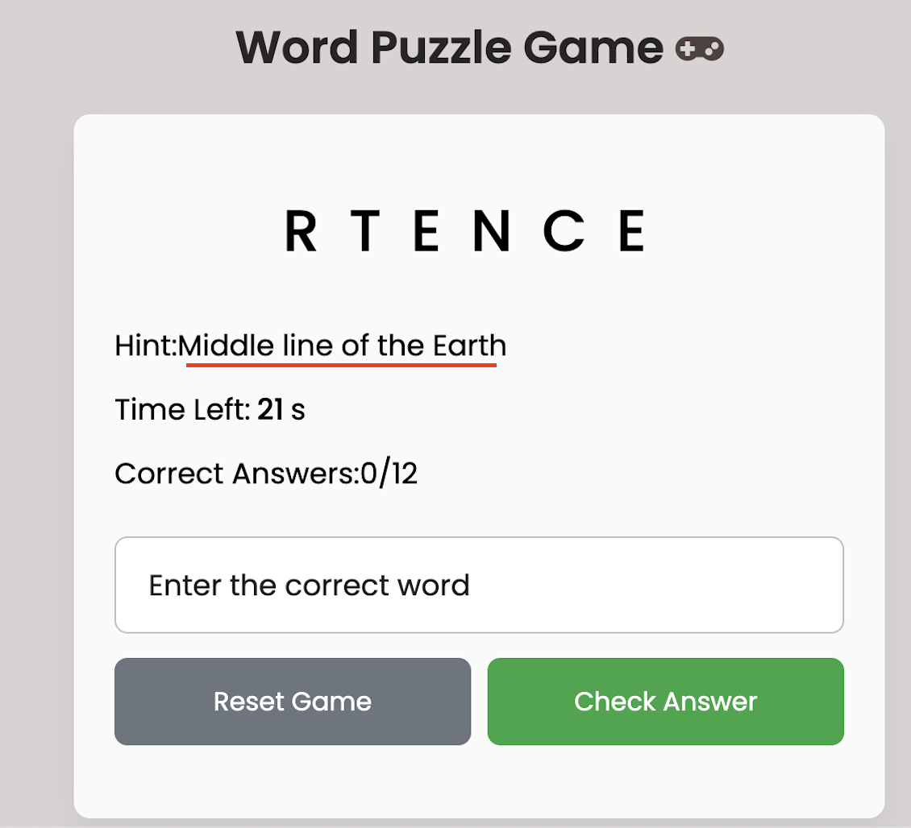
## Timer:
A 30-second timer is displayed for each word. The player must answer before the timer runs out.
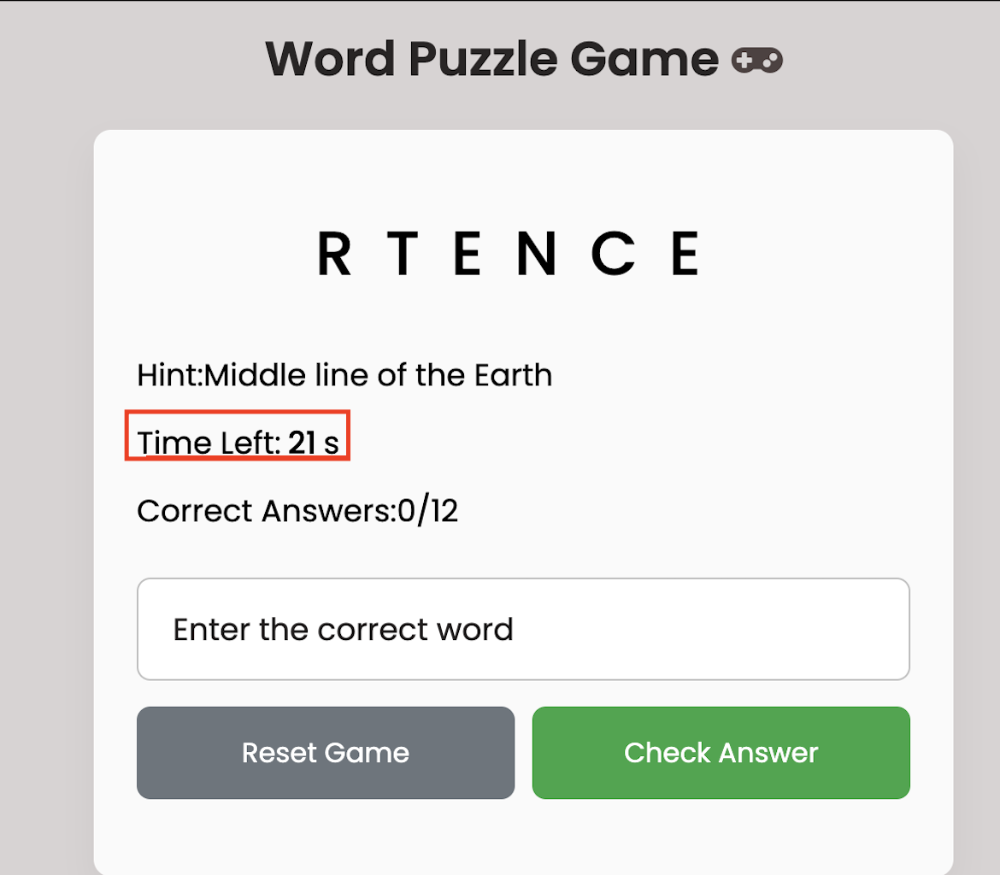
## Score Tracking:
The game tracks the number of correct answers and displays the score at the end of the game.
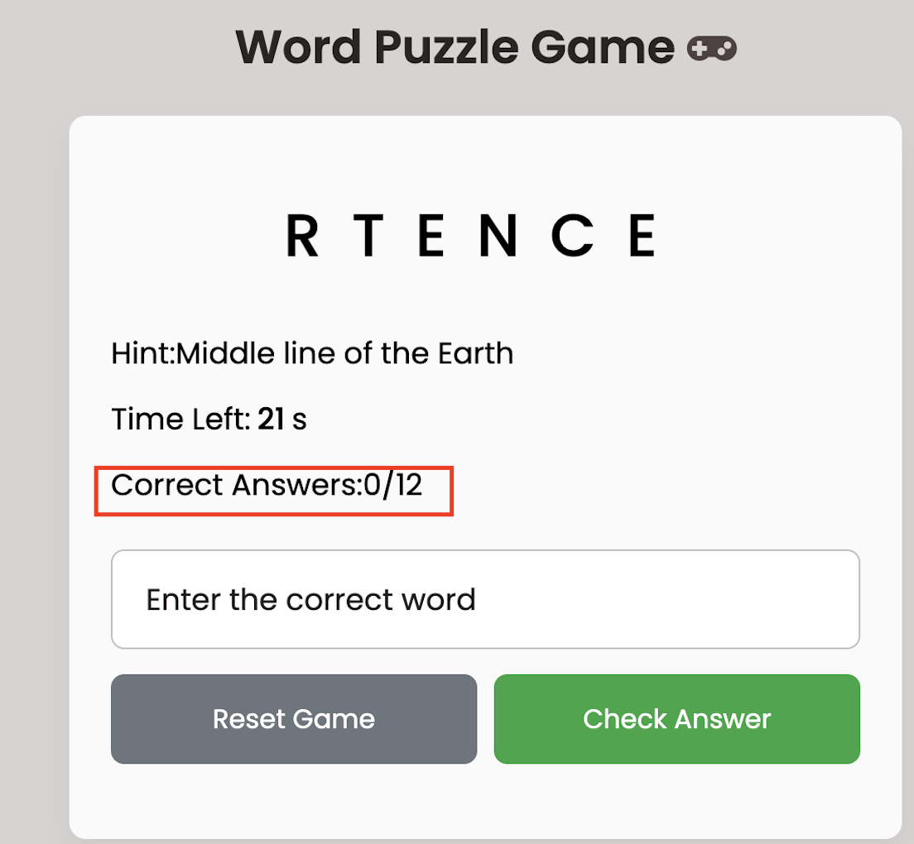
## Feedback:
Instant feedback is provided after each answer (correct, wrong, or time's up).
   #### correct answer Feedback
   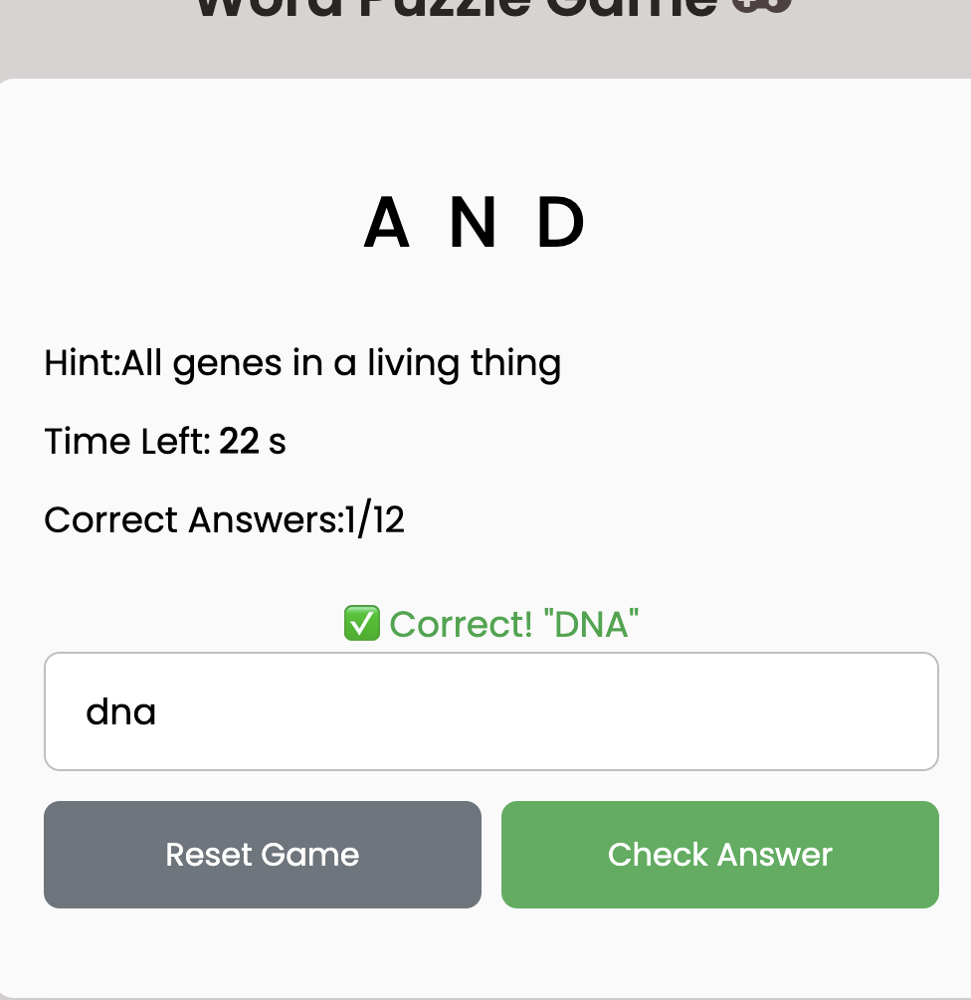
   #### Wrong answer Feedback
   
   ### time's up Feedback
   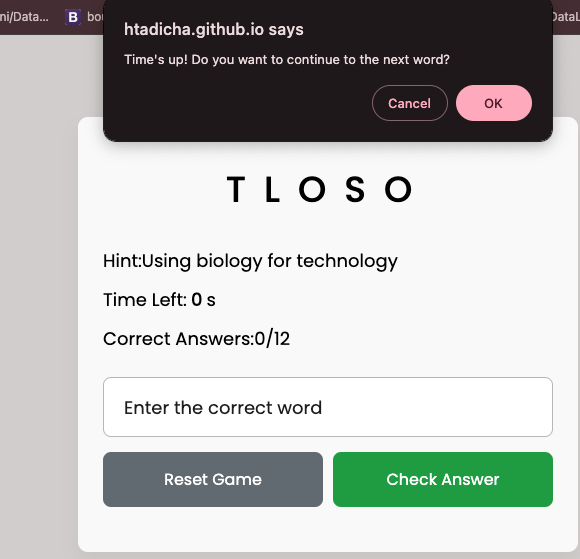

   # Game Flow
### Initialization:
The game initializes with a scrambled word, a hint, and a timer.
### Player Input:
The player types their answer in the input field and clicks the "Check Answer" button.
### Validation:
The game checks if the player's answer matches the correct word.
- If correct, the score is incremented, and the game moves to the next word.
- If incorrect, the game displays an error message and allows the player to try again.

### Timer:
If the timer runs out without user trying to type any word, the game asks the player if they want to continue.
    - If the player chooses to continue, the current word is marked as incorrect, and the game moves to the next word.
    - If the player chooses not to continue, the game ends, and the final score is displayed.

### Game Over:
The game displays the final score and asks the player if they want to play again.

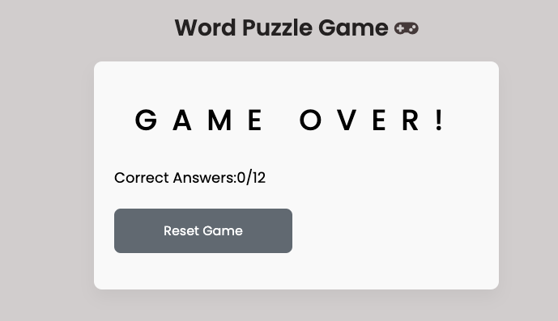

### Score:
The game displays the final score and asks the player if they want to play again to click on reset.

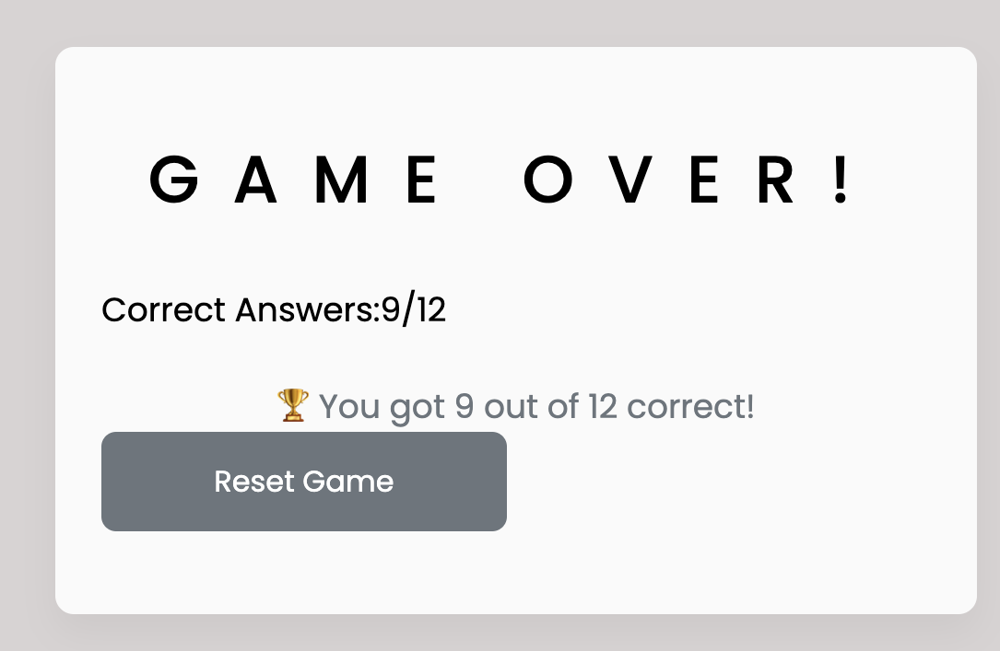

 ## Testing
 ### Validator testing
 - HTML
   - No error were returned when passing through the official [W3C HTML validator](https://validator.w3.org/nu/#textarea) when direct text is used.
- CSS
  - No erros were returned when passing through the official [W3C CSS Validator (Jigsaw)](https://jigsaw.w3.org/css-validator/validator) by using direct text.
- avascript
     - No error found when passing the JS code through the
     [JSHint JavaScript Validator](https://jshint.com/)

 

 ### Manual testiing

 #### Browser Compatibility
1. __Google Chrome:__ No issues with appearance, responsiveness, or functionality.
2. __Safari:__ No issues with appearance, responsiveness, or functionality.
3. __Mozilla Firefox:__ No issues with appearance, responsiveness, or functionality.
4. __Microsoft Edge:__ No issues with appearance, responsiveness, or functionality.

 #### Device compatibility
1. __MacBook Pro 13:__ No issues with appearance, responsiveness, or functionality.
2. __iPhone 13 Mini:__ No issues with appearance, responsiveness, or functionality.
3. __iPad 9th Generation:__ No issues with appearance, responsiveness, or functionality.
4. __Iphone 14:__ No issues with appearance, responsiveness, or functionality.
4. __Iphone 15 pro and pro max:__ No issues with appearance, responsiveness, or functionality.
### The Lighthouse Test
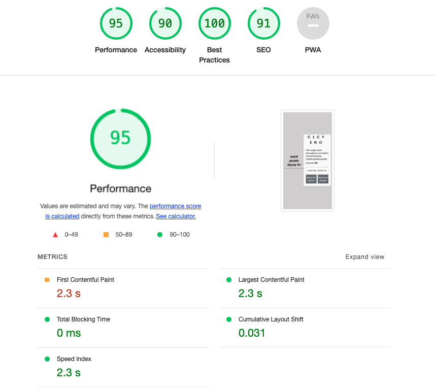
## Technologies used
- HTML
- CSS
- Javascript
## Framework used
- Git
- Vscode
- Font Awsome
- Flaticon
- Youtube
- Am I Responsive
- Google
- ChatGPT- for randomw word generation

## Unfixed bugs
Contrast error found and wasn't fixed bacause it wasn't a major issues that affects the functionality of the site.
## Deployment
The site was deployed to GitHub pages. The steps to deploy are as follows:
1. In the GitHub repository, navigate to the Settings tab
2. From the source section drop-down menu, select the Master Branch
3. Once the master branch has been selected, the page will be automatically refreshed with a detailed ribbon display to indicate the successful deployment. The live link can be found [here](https://htadicha.github.io/Brain-Teaser-word-Quiz/)

## Credits
### Media
No media taken from external sources.
### Codes
- css elements taken from previous class exercises and 
- Some of the css and HTML elements are taken from ChatGPT and google
- part of css elements are taken from the w3 sites.
- some part of the JS code taken from [Treehouse.com](https://teamtreehouse.com/community/how-do-i-set-up-setinterval-clearinterval-settimeout-and-cleartimeout-properly-alsodo-i-need-to-use-all-4)
- Event listener taken from the training and [mdn-webdocs](https://developer.mozilla.org/en-US/docs/Web/Events)
- Inspiration taken from Codin Nepal [videos](https://www.youtube.com/channel/UCk7xIEmd3MeyhIu2StLX5yA) 
- Free codeacademy Javascript training provided was of great importance help.
- some JS taken from this [github](https://github.com/Code-Institute-Solutions/love-maths-2.0-sourcecode/blob/master/03-displaying-the-question-and-answer/01-displaying-the-addition-question/assets/js/script.js
) and [the geeksforgeeks website](https://www.geeksforgeeks.org/word-guessing-game-using-html-css-and-javascript/) and edited.
- All other credits provided in the code and projects.
## Acknowledgements.
I would like to thank:

My mentor Can Sücüllü for his feedback, advice and guidance in the previous work which served to be of continuos importance;
Code Institute Slack Community for providing help through Learnjs channels, small talk and peer reviews of others projects served to be of great importance in this project, in particular:
All the CodeInstitute instructors for their comprehensive training and for the tailored made material that enhanced my understanding of the module.